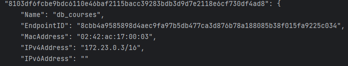

# Онлайн-школа

## Описание

Проект представляет собой backend часть веб-приложения для онлайн-обучения (LMS). Реализовано API с помощью Django REST
Framework.

## Технологии:

- Python 3.7+
- Django 4.2.2
- DRF 3.14.0
- База данных PostgreSQL
- Celery 5.3.1
- Redis
- Pillow
- PyJWT
- Requests
- Stripe

## Архитектура

- БД PostgreSQL для хранения данных
- API на Django REST Framework работает как основной сервер приложения
- Celery + Redis для очередей задач и асинхронной обработки (рассылка уведомлений)
- Stripe используется для интеграции платежей
- Pillow для работы с изображениями в моделях
- PyJWT для работы с JWT авторизацией
- Django Filter для фильтрации данных в API

## Данные

**Основные сущности данных:**

- Пользователи (ученики, преподаватели)
- Курсы
- Уроки
- Платежи и подписки на курсы

#### Связи между сущностями позволяют реализовать требуемый функционал LMS.

## API

**Основные endpoint'ы:**

- /users/user/ - CRUD пользователей
- /courses/course/ - CRUD курсов
- /lessons/ - CRUD уроков
- /payments/ - платежи и подписки

#### Документация доступна в Swagger/Redoc.

## Запуск проекта

1. #### Клонировать репозиторий, перейти в папку проекта.

2. #### Создать и активировать виртуальное окружение.

3. #### Установить зависимости:

```
pip install -r requirements.txt
```

4.  #### Установить и настроить сервисы:

- PostgreSQL
- Redis

5. #### Выполнить миграции:

```
python manage.py migrate
```

6. #### Загрузка данных

- Для загрузки начальных данных в БД:

```
python manage.py loaddata db.json
```

7. #### Запустить dev-сервер:

```
python manage.py runserver
```

- Доступно по адресу http://localhost:8000

8. #### Создание периодической задачи на проверку статуса платежей

```
python manage.py add_tasks
```

9. #### Запуск Celery

```
celery -A config worker -l INFO -P eventlet
```

10. #### Запуск celery-beat

```
celery -A config worker --beat --loglevel=info
```

## Тестирование

- Для запуска тестов:

```
python manage.py test
```

## Покрытие кода тестами

- Запуск:

```
coverage run --source='.' manage.py test
```

```
coverage report
```
## Docker
- для начала создайте отдельный файл `.env.docker` и пропишите в `POSTGRES_HOST` явный адрес. А в `CELERY_BROKER_URL` и
`CELERY_RESULT_BACKEND` пропишите следующие:
```
CELERY_BROKER_URL=redis://redis:6379
CELERY_RESULT_BACKEND=redis://redis:6379
```
#### для того чтобы посмотреть явный адрес выполните следующие команды:
```
docker network list 
```
находите там вам нужный NETWORK ID
```
docker network inspect <NETWORK ID>
```


- чтобы собрать Docker-образ
```
docker build -t <название_образа> .
```
### Сборка образа и запуск в фоне после успешной сборки
```
docker-compose up -d —build
```
- для остановки
```
docker-compose down
```
## Документация

### Документация доступна по адресам:

```bash
http://localhost:8000 /redoc/ или /swagger/
```


